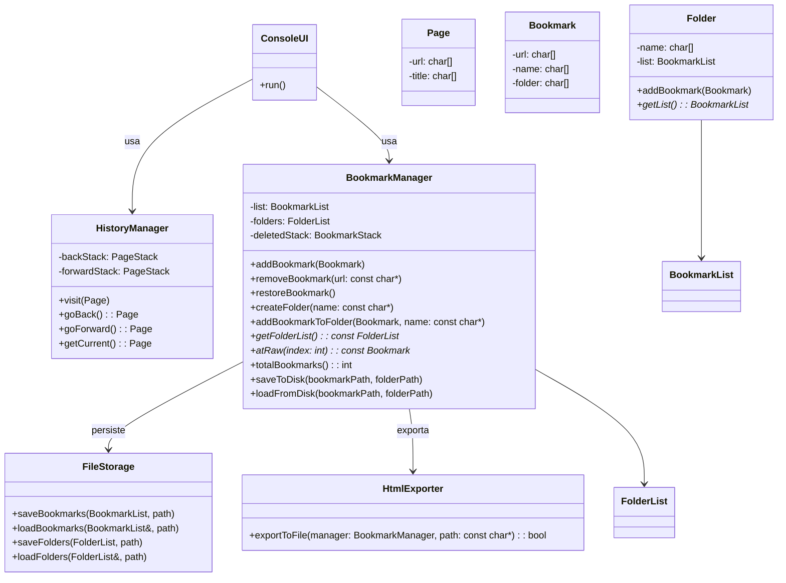

# Proyecto pseudo-web scrapper

## 1. Introducción

Breve descripción del propósito y alcance del simulador de navegador y gestión de favoritos web.

## 2. Descripción del problema

Contexto del proyecto: simular la navegación en un navegador web y gestionar favoritos, sin navegación real.

## 3. Requerimientos del sistema

### 3.1 Requerimientos funcionales

1. Navegar a una página web (registro en historial).
2. Navegar a una página de favoritos (selección o búsqueda por URL o nombre).
3. Navegar hacia adelante en el historial.
4. Navegar hacia atrás en el historial.
5. Guardar un favorito (URL y nombre únicos).
6. Eliminar un favorito (por lista, nombre o URL).
7. Restaurar favoritos eliminados (máximo 5, orden LIFO).
8. Organizar favoritos en carpetas.
9. Exportar favoritos a HTML.
10. Guardar y cargar favoritos desde disco.
11. Interacción por consola a través de menú.

### 3.2 Requerimientos no funcionales

- Persistencia de favoritos en archivos de texto.
- Estructura de 3 capas: presentación, lógica de negocio, persistencia.
- Interfaz de consola con menú interactivo.
- Código modular, legible y con pruebas unitarias e integración.

## 4. Casos de uso

- Descripción de flujos: navegar, agregar/eliminar/restaurar favorito, organizar en carpetas, guardar/cargar, exportar a HTML.

## 5. Diseño de la arquitectura

### 5.1 Capas del sistema

- **Capa de presentación**: UI por consola con menú interactivo.
- **Capa de negocios**: `BookmarkManager`, `HistoryManager`, validación y lógica de datos.
- **Capa de datos**: persistencia en archivos (`FileStorage`, `HtmlExporter`).

### 5.2 Diagrama de componentes y clases (Mermaid actualizado)

## 6. Estructuras de datos y diagrama de clases

- **Historial**: dos pilas (`PageStack`) para navegación hacia atrás y adelante.
- **Favoritos**: lista lineal (`BookmarkList`) y carpetas (`FolderList` → `Folder` → `BookmarkList`).
- **Pila de eliminados**: `BookmarkStack`, tamaño máximo 5.
- **Estructuras auxiliares**: utilidades de cadenas (`StringUtils`), sin uso de STL.

## 7. Plan de pruebas

- Pruebas unitarias por entidad (`Bookmark`, `Folder`, `BookmarkManager`, etc.).
- Pruebas de integración para operaciones compuestas (agregar + guardar + cargar, etc.).
- Pruebas UI para cada opción de menú (simuladas manualmente vía `BookmarkManager`).
- Validación de errores (eliminar inexistente, exportar sin favoritos, restaurar vacío).

## 8. Cronograma y entregables

- Fase 1: Análisis y documentación (1 semana).
- Fase 2: Diseño y estructura base de clases y pruebas (1 semana).
- Fase 3: Implementación funcional por capas y pruebas (2 semanas).
- Fase 4: UI por consola + refinamiento + exportación (1 semana).
- Entrega final: informe completo, código, pruebas y documentación actualizada.

## 9. Plan de implementación en código

**Nota**: Archivos `.h` en `include/`, archivos `.cpp` en `src/` divididos por dominio (`business/`, `file/`, `ui/`, `utility/`). Se trabaja con TDD (pruebas antes que implementación).

### Pasos en orden lógico:

1. **Estructuras básicas**

   - `Page`, `Bookmark`, `PageStack`, `BookmarkList`, `BookmarkStack`, `Folder`, `FolderList`, `StringUtils`.

2. **Gestores**

   - `HistoryManager` con `visit()`, `goBack()`, `goForward()`.
   - `BookmarkManager` con `addBookmark()`, `removeBookmark()`, `restoreBookmark()`, `addBookmarkToFolder()`, `createFolder()`.

3. **Persistencia**

   - `FileStorage`: `saveBookmarks`, `loadBookmarks`, `saveFolders`, `loadFolders`.
   - Integración en `BookmarkManager` con `saveToDisk()` y `loadFromDisk()`.

4. **Exportación**

   - `HtmlExporter::exportToFile()`.
   - Exportar lista completa de favoritos y carpetas a archivo `.html`.

5. **Interfaz de usuario (UI)**

   - `ConsoleUI` con menú principal:

     1. Ver favoritos sueltos
     2. Ver favoritos por carpeta
     3. Agregar favorito
     4. Eliminar favorito
     5. Crear carpeta
     6. Agregar favorito a carpeta
     7. Guardar
     8. Cargar
     9. Exportar a HTML
     10. Salir

6. **Pruebas**

   - Tests unitarios e integración por carpeta `tests/`.
   - Validación de cada funcionalidad del menú como pruebas de integración independientes.

---
