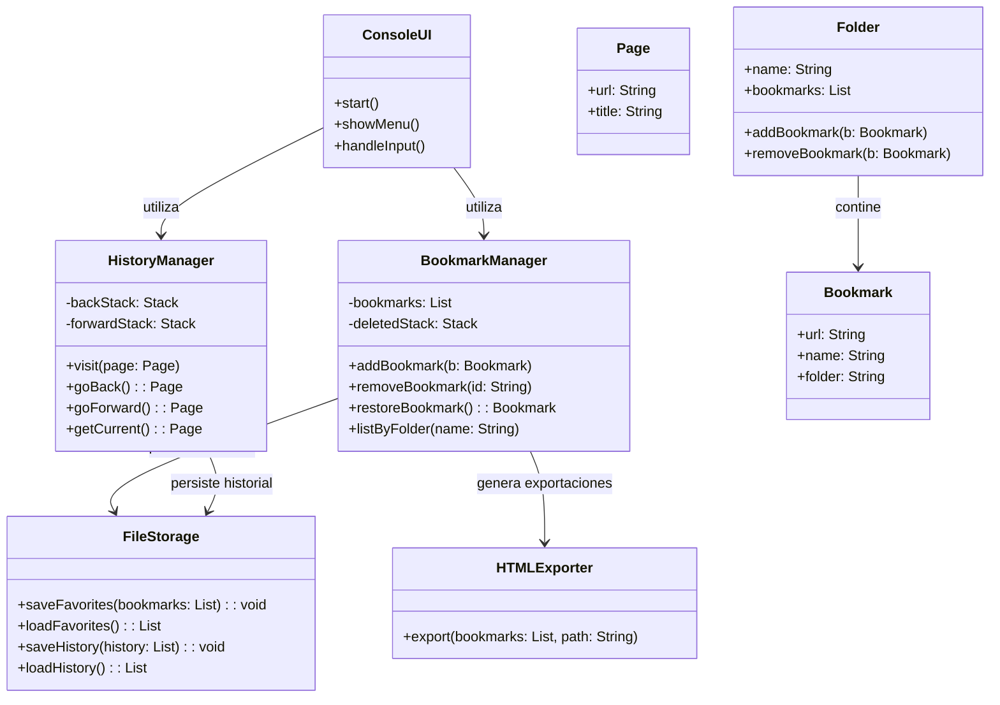

# Proyecto pseudo-web scrapper

## 1. Introducción

Breve descripción del propósito y alcance del simulador de navegador y gestión de favoritos web.

## 2. Descripción del problema

Contexto del proyecto: simular la navegación en un navegador web y gestionar favoritos, sin navegación real.

## 3. Requerimientos del sistema

### 3.1 Requerimientos funcionales

1. Navegar a una página web (registro en historial).
2. Navegar a una página de favoritos (selección o búsqueda por URL o nombre).
3. Navegar hacia adelante en el historial.
4. Navegar hacia atrás en el historial.
5. Guardar un favorito (URL y nombre únicos).
6. Eliminar un favorito (por lista, nombre o URL).
7. Restaurar favoritos eliminados (máximo 5, orden LIFO).
8. Organizar favoritos en carpetas.
9. Exportar favoritos a HTML.

### 3.2 Requerimientos no funcionales

- Persistencia de favoritos en archivo de texto.
- Estructura de 3 capas: presentación, negocios, datos.
- Interfaz de consola.
- Legibilidad y estilo de código comentado.

## 4. Casos de uso

- Descripción de flujos: navegar, agregar favorito, eliminar, restaurar, organizar, exportar.

## 5. Diseño de la arquitectura

### 5.1 Capas del sistema

- **Capa de presentación**: clases para interfaz de consola.
- **Capa de negocios**: lógica de navegación y gestión de favoritos.
- **Capa de datos**: lectura y escritura en archivos de texto.

## 5.2 Diagrama de componentes y clases

Para visualizar la organización del sistema y sus entidades, a continuación un diagrama más detallado en **Mermaid** que muestra componentes, clases y sus relaciones:

## 6. Estructuras de datos y diagrama de clases Estructuras de datos y diagrama de clases

- **Historial**: lista doble enlazada o dos pilas para atrás/adelante.
- **Favoritos**: lista de objetos {URL, nombre, carpeta}.
- **Pila de eliminados**: pila LIFO tamaño máximo 5.

## 7. Plan de pruebas

- Pruebas unitarias para cada función.
- Pruebas de integración de capas.
- Pruebas de manejo de errores y límites.

## 8. Cronograma y entregables

- Fase 1: Análisis y documentación (1 semana).
- Fase 2: Diseño y diagramas (1 semana).
- Fase 3: Implementación (2 semanas).
- Fase 4: Pruebas y refinamiento (1 semana).
- Entrega final: Informe con documentación, código y resultados de pruebas.

## 9. Plan de implementación en código

A continuación, los pasos ordenados para el desarrollo en código:

1. **Estructuras de datos básicas**

   - Implementar la clase `Page` con atributos `url` y `title`.
   - Crear la clase `HistoryManager` con dos pilas (`backStack`, `forwardStack`) y métodos `visit(Page)`, `goBack()`, `goForward()`.

2. **Gestión de favoritos**

   - Definir la clase `Bookmark` con `url`, `name` y opcional `folder`.
   - Implementar `BookmarkManager` con:

     - Lista de favoritos.
     - Pila LIFO para favoritos eliminados (tamaño 5).
     - Métodos `addBookmark(Bookmark)`, `removeBookmark(String urlOrName)`, `restoreBookmark()`.

3. **Organización en carpetas**

   - Extender `BookmarkManager` para manejar carpetas: `createFolder()`, `moveBookmarkToFolder()`, `listByFolder()`.

4. **Persistencia de datos**

   - Implementar la capa de datos: clase `FileStorage` con métodos `saveFavorites(List<Bookmark>)` y `loadFavorites()`.
   - Asegurar serialización y deserialización en un archivo de texto.

5. **Interfaz de consola**

   - Crear `ConsoleUI` con menú interactivo:

     - Opciones: navegar, atrás, adelante, agregar favorito, eliminar, restaurar, listar favoritos, organizarlos, exportar.

   - Leer entradas de usuario y llamar a los métodos correspondientes de los managers.

6. **Exportación a HTML**

   - Añadir en `BookmarkManager` o en una clase `HTMLExporter` método `exportToHTML(String filePath)`.
   - Generar un archivo `.html` con la lista jerárquica de favoritos y carpetas.

7. **Pruebas unitarias**

   - Escribir tests para `HistoryManager`, `BookmarkManager`, `FileStorage` y `HTMLExporter`.
   - Cobertura de casos límite (p. ej., pila de historial vacía, límite de restauración de favoritos).

8. **Integración y refinamiento**

   - Integrar todas las capas en `main()`.
   - Validar flujo completo: navegar, marcar, exportar.
   - Pulir mensajes de consola y manejo de errores.

---
